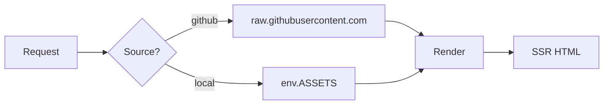

# Markdown features

Vellum's parser is [markdown-it](https://github.com/markdown-it/markdown-it)
with a curated plugin set. Anything that works in VitePress should work
identically here; the OPS extensions stack on top
(see [OPS extensions](./ops-extensions)).

For exhaustive visual tests of every feature, see the
[Feature tests](./tests/) section.

## Standard markdown

GitHub Flavored Markdown is fully supported:

- Headings, paragraphs, emphasis, strikethrough, links, images.
- Lists (ordered, unordered, nested), task lists.
- Tables with alignment.
- Blockquotes.
- Fenced code blocks.
- Inline HTML — including PascalCase tags that resolve to React components.

## Containers

The VitePress-style `:::` syntax produces typed callouts. Eight kinds are
built in: `tip`, `info`, `note`, `warning`, `caution`, `danger`, `important`,
`details`.

```md
::: tip
A green tip. Optional title: `::: tip Heads up`
:::

::: warning
A yellow warning.
:::

::: danger
A red danger. Same chrome as ::: important.
:::

::: details Show example
A collapsible disclosure block. Click the summary to expand.
:::
```

::: tip Heads up
A green tip. Optional title: `::: tip Heads up`
:::

::: warning
A yellow warning.
:::

::: danger
A red danger. Same chrome as `::: important`.
:::

::: details Show example
A collapsible disclosure block. Click the summary to expand.
:::

### Nested containers

Vellum's parser handles arbitrary nesting across different container types.
Standard `:::` markers work even when the inner container shares the same
delimiter count:

```md
::: details Expand for the inner example
::: warning
Nested warning inside a details. Both close with their own `:::`.
:::
:::
```

::: details Expand for the inner example
::: warning
Nested warning inside a details. Both close with their own `:::`.
:::
:::

::: note Behind the scenes
The default `markdown-it-container` only forward-scans for the next `:::`
regardless of nesting, so the stock VitePress workaround is to use four
colons for the outer container. Vellum's
[`containers.ts`](https://github.com/siiway/vellum/blob/main/src/worker/markdown/containers.ts)
replaces that with a depth-tracking parser so plain `:::` works as authors
expect.
:::

## GFM alerts

GitHub's `> [!KIND]` syntax is rewritten into the same callout primitives:

```md
> [!NOTE]
> Equivalent to ::: info.

> [!TIP]
> Equivalent to ::: tip.

> [!IMPORTANT]
> Equivalent to ::: important.

> [!WARNING]
> Equivalent to ::: warning.

> [!CAUTION]
> Equivalent to ::: caution.
```

## Code blocks

Fenced blocks are highlighted with Shiki at parse time, server-side. The
fence info string accepts language, filename, line numbers, and highlight
ranges:

```md
`​``ts:line-numbers [src/worker/sources.ts] {2,4-6}
export async function fetchSourceFile(env, repo, ref, path) {
  if (repo.source === "local") return fetchLocalFile(env, repo, path);
  return fetchGitHubRaw(env, repo.owner, repo.repo, ref, path);
}
`​``
```

The card chrome (header bar with filename + language pill + copy button)
appears whenever `filename` or `lang` is set; otherwise it's just the code
surface with a floating copy button on hover.

### Code groups

`::: code-group` wraps multiple fences into a tab strip:

```md
::: code-group

`​``ts [TypeScript]
console.log("ts");
`​``

`​``py [Python]
print("py")
`​``

:::
```

::: code-group

```ts [TypeScript]
console.log("ts");
```

```py [Python]
print("py")
```

:::

## Tables

Standard pipe tables with optional alignment:

| Column A | Centered | Right-aligned |
| :------- | :------: | ------------: |
| `code`   |   mid    |          1.23 |
| **bold** |   data   |        42,000 |

## Mermaid

Fenced blocks with the `mermaid` language are pre-rendered server-side via
[Kroki](./caching-and-deployment#external-services) in **both** light and
dark palettes, so theme switching is instant and doesn't need to load any
mermaid JS in the browser.

```md
`​``mermaid
flowchart LR
  A[Request] --> B{Source?}
  B -->|github| C[raw.githubusercontent.com]
  B -->|local| D[env.ASSETS]
  C & D --> E[Render]
  E --> F[SSR HTML]
`​``
```



When Kroki is unreachable, the client lazy-loads the ~600KB mermaid runtime
and renders the diagram itself — graceful degradation rather than a blank
card.

## Math

`$inline$` and `$$display$$` math are rendered to inline SVG by
[markdown-it-mathjax3](https://www.npmjs.com/package/markdown-it-mathjax3)
at parse time. No client-side library required.

```md
The Pythagorean theorem is $a^2 + b^2 = c^2$.

$$
e^{i\pi} + 1 = 0
$$
```

The Pythagorean theorem is $a^2 + b^2 = c^2$.

$$
e^{i\pi} + 1 = 0
$$

## Other goodies

- **Task lists**: `- [x] done`, `- [ ] todo` (via `markdown-it-task-lists`).
- **Footnotes**: `Text[^1]` ... `[^1]: Footnote body` (via `markdown-it-footnote`).
- **Emoji**: `:rocket:` → 🚀 (via `markdown-it-emoji`, GitHub shortcodes).
- **Attribute lists**: `{#anchor .class data-x="y"}` on headings and other
  block elements (via `markdown-it-attrs`, with a safe allowlist).
- **Outline auto-generation** from headings, drives the right-rail TOC.

For working examples of all of the above, browse the
[Feature tests](./tests/).
