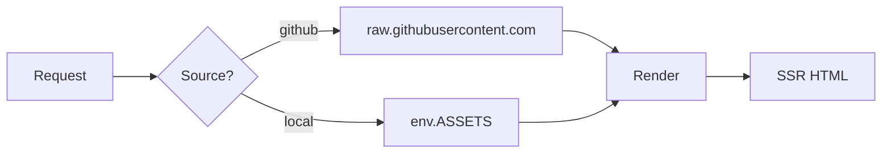
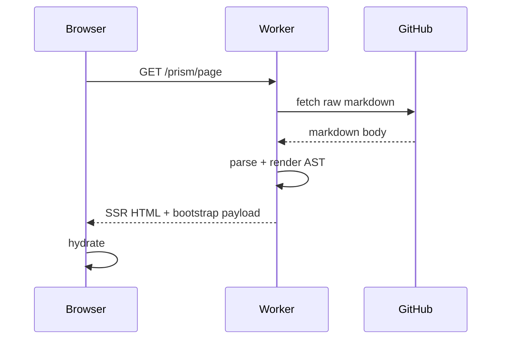
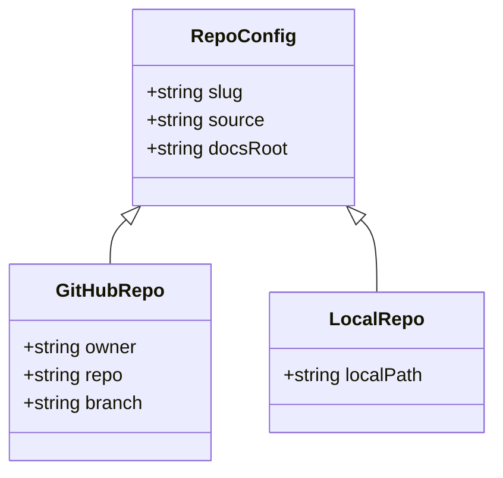
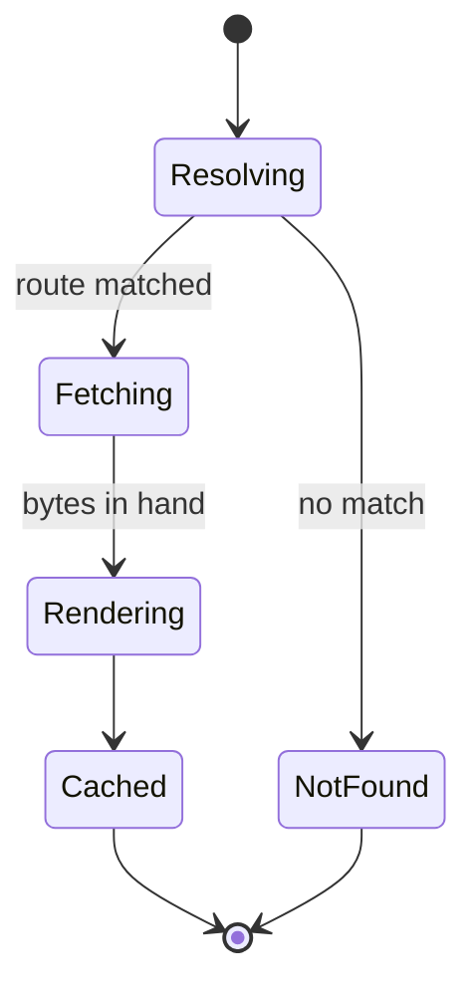
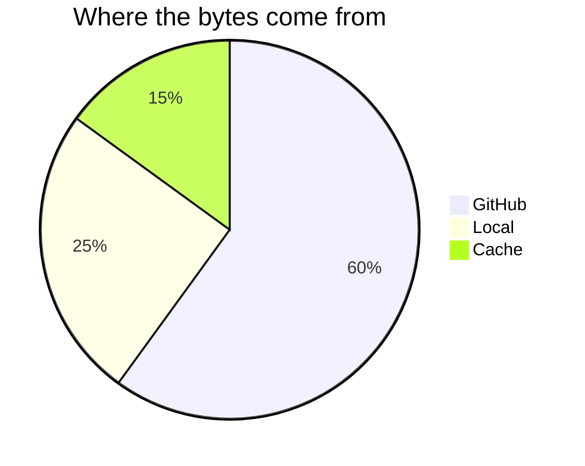

# Mermaid Diagrams

The worker pre-renders each diagram against Kroki in both light and dark themes
and ships both SVGs in the bootstrap payload. Toggling the theme swaps them
instantly. If Kroki was unreachable, the client downloads the ~600KB mermaid
runtime and renders client-side.

## Flowchart

## Sequence diagram

## Class diagram

## State diagram

## Pie chart

