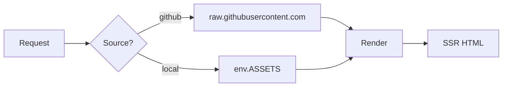

# Markdown 特性

Vellum 的解析器是 [markdown-it](https://github.com/markdown-it/markdown-it)
加上一套精选的插件集合。任何在 VitePress 里能用的写法在这里都能用；
OPS 扩展叠加在它之上（见 [OPS 扩展](./ops-extensions)）。

每个特性都有完整的视觉测试，详见 [功能测试](./tests/) 一节。

## 标准 markdown

完整支持 GitHub Flavored Markdown：

- 标题、段落、强调、删除线、链接、图片。
- 列表（有序、无序、嵌套）、任务列表。
- 带对齐的表格。
- 引用块。
- 围栏代码块。
- 行内 HTML——包括会解析为 React 组件的 PascalCase 标签。

## 容器

VitePress 风格的 `:::` 语法会产生有类型的提示框。内置 8 种：
`tip`、`info`、`note`、`warning`、`caution`、`danger`、`important`、`details`。

```md
::: tip
A green tip. Optional title: `::: tip Heads up`
:::

::: warning
A yellow warning.
:::

::: danger
A red danger. Same chrome as ::: important.
:::

::: details Show example
A collapsible disclosure block. Click the summary to expand.
:::
```

::: tip Heads up
A green tip. Optional title: `::: tip Heads up`
:::

::: warning
A yellow warning.
:::

::: danger
A red danger. Same chrome as `::: important`.
:::

::: details Show example
A collapsible disclosure block. Click the summary to expand.
:::

### 嵌套容器

Vellum 的解析器支持任意嵌套不同类型的容器。即便内层容器使用了相同
数量的冒号，标准的 `:::` 也能正常工作：

```md
::: details Expand for the inner example
::: warning
Nested warning inside a details. Both close with their own `:::`.
:::
:::
```

::: details Expand for the inner example
::: warning
Nested warning inside a details. Both close with their own `:::`.
:::
:::

::: note 内部细节
标准的 `markdown-it-container` 不考虑嵌套，只往前扫到下一个 `:::`
就关闭，所以 VitePress 的常见绕过办法是用四个冒号写外层。
Vellum 的
[`containers.ts`](https://github.com/siiway/vellum/blob/main/src/worker/markdown/containers.ts)
用一个深度跟踪的解析器替换了它，所以纯 `:::` 就能按作者预期工作。
:::

## GFM 提示

GitHub 的 `> [!KIND]` 语法被重写到同一套提示框原语上：

```md
> [!NOTE]
> Equivalent to ::: info.

> [!TIP]
> Equivalent to ::: tip.

> [!IMPORTANT]
> Equivalent to ::: important.

> [!WARNING]
> Equivalent to ::: warning.

> [!CAUTION]
> Equivalent to ::: caution.
```

## 代码块

围栏代码块在解析期就被 Shiki 在服务端高亮。fence 信息串支持
语言、文件名、行号、高亮范围：

```md
`​``ts:line-numbers [src/worker/sources.ts] {2,4-6}
export async function fetchSourceFile(env, repo, ref, path) {
  if (repo.source === "local") return fetchLocalFile(env, repo, path);
  return fetchGitHubRaw(env, repo.owner, repo.repo, ref, path);
}
`​``
```

只要设置了 `filename` 或 `lang`，就会出现卡片样式的顶栏（文件名 +
语言徽章 + 复制按钮）；否则仅显示代码区域，鼠标悬停时出现浮动的
复制按钮。

### 代码组

`::: code-group` 把多个 fence 包装成一个 tab 条：

```md
::: code-group

`​``ts [TypeScript]
console.log("ts");
`​``

`​``py [Python]
print("py")
`​``

:::
```

::: code-group

```ts [TypeScript]
console.log("ts");
```

```py [Python]
print("py")
```

:::

## 表格

支持带可选对齐的标准 pipe 表格：

| Column A | Centered | Right-aligned |
| :------- | :------: | ------------: |
| `code`   |   mid    |          1.23 |
| **bold** |   data   |        42,000 |

## Mermaid

`mermaid` 语言的围栏代码块会通过
[Kroki](./caching-and-deployment#external-services) 在服务端 **同时**
预渲染浅色和深色两个版本，所以切换主题是瞬时的，浏览器无需加载任何
mermaid JS。

```md
`​``mermaid
flowchart LR
  A[Request] --> B{Source?}
  B -->|github| C[raw.githubusercontent.com]
  B -->|local| D[env.ASSETS]
  C & D --> E[Render]
  E --> F[SSR HTML]
`​``
```



当 Kroki 不可达时，客户端会按需懒加载 ~600KB 的 mermaid 运行时
并在本地渲染——优雅降级而非显示空白卡片。

## 数学公式

`$inline$` 与 `$$display$$` 形式的数学公式由
[markdown-it-mathjax3](https://www.npmjs.com/package/markdown-it-mathjax3)
在解析期渲染为行内 SVG。不需要任何客户端库。

```md
The Pythagorean theorem is $a^2 + b^2 = c^2$.

$$
e^{i\pi} + 1 = 0
$$
```

The Pythagorean theorem is $a^2 + b^2 = c^2$.

$$
e^{i\pi} + 1 = 0
$$

## 其它好东西

- **任务列表**：`- [x] done`、`- [ ] todo`（由 `markdown-it-task-lists` 支持）。
- **脚注**：`Text[^1]` ... `[^1]: Footnote body`（由 `markdown-it-footnote` 支持）。
- **Emoji**：`:rocket:` → 🚀（由 `markdown-it-emoji` 支持 GitHub 简写码）。
- **属性列表**：标题和其它块元素可以加 `{#anchor .class data-x="y"}`
  （由 `markdown-it-attrs` 支持，带安全允许列表）。
- **自动生成大纲**：根据标题层级生成，驱动右侧的 TOC。

以上的可工作示例都在 [功能测试](./tests/) 里。
